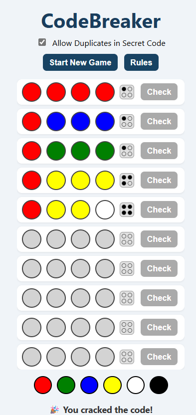

# MastermindGame-ColorCodeBreaker
**🧠 CodeBreaker – The Mastermind Color Guessing Game**

 

## 📝 Description  
**CodeBreaker** is a fun and interactive version of the classic Mastermind game built using **HTML, CSS, and JavaScript**.

- 🔐 Guess the secret color code in 10 attempts or less  
- 🎨 Choose from 6 vibrant colors  
- 🔁 Toggle between allowing duplicate colors or not  
- 📜 View game rules in a handy popup modal  

---

## ⚙️ Features
- 💡 Dynamic feedback pegs for guess accuracy
- 👩‍🎨 User-friendly color palette
- 🔄 “Start New Game” resets all progress
- 💬 Real-time win/loss messages

---

## 🚀 Tech Stack
- HTML5  
- CSS3 (Responsive)  
- JavaScript  

---

## 📁 Project Structure

```
/codebreaker-game
│
├── index.html
├── style.css
├── script.js
├── assets/
│   └── colorCodeBreakerGame.png
└── README.md
```

---


